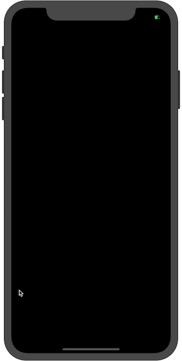

# FizzleFade

## 🛑🛑🛑

This was implemented using [Fabien Sanglard's](http://fabiensanglard.net) great [article](http://fabiensanglard.net/fizzlefade/index.php) breaking down how this was done for Wolfenstein 3D in 1992.
